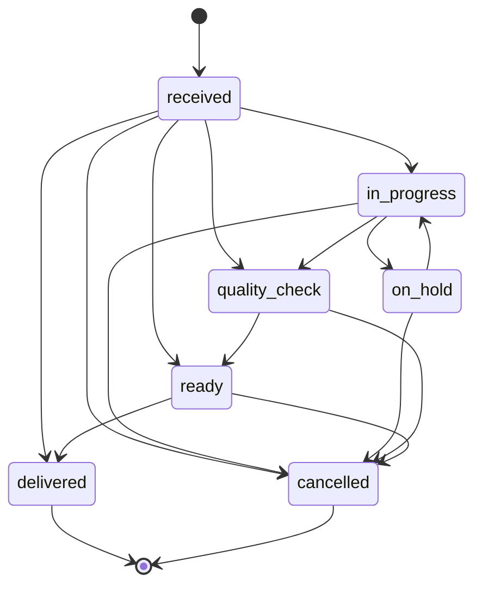
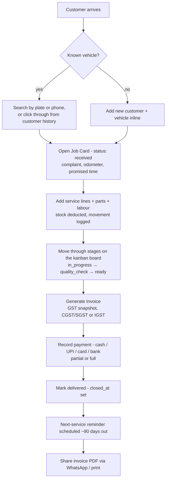
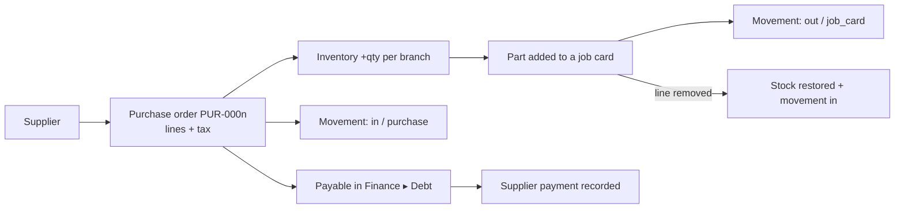
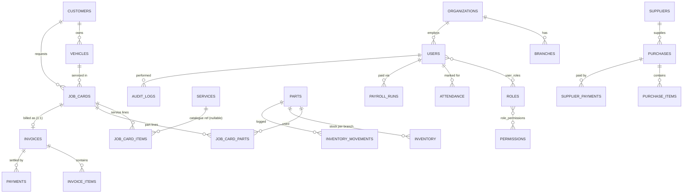

# GarageOS — Project Documentation

*A workshop & garage management system. Each customer runs their own independent instance on a cloud server they own, accessed from any browser on any device.*

`v0.2` · `2026-09-21` · Plain PHP 8.4 + PostgreSQL · Sister project: RetailOS · Author: shafivilayil2201@gmail.com

> **How to read this document.** §1–3 explain *why* GarageOS exists and *who* uses it. §4–6 explain *how it is built* (architecture, stack, code layout). §7–8 are the *product*: every module, and the end-to-end business flows that connect them. §9–11 cover data, API and security. §12–13 cover deployment/operations and engineering conventions. §14 is an honest status report — what is built, what is planned, and known issues. This replaces the v0.1 design draft (2026-09-10); where v0.1 described something as planned that now exists, this document describes it as built.

---

## Table of contents

1. [Executive summary](#1-executive-summary)
2. [The problem](#2-the-problem)
3. [The solution & who it's for](#3-the-solution--who-its-for)
4. [System architecture](#4-system-architecture)
5. [Technology stack](#5-technology-stack)
6. [Code structure](#6-code-structure)
7. [Modules](#7-modules)
8. [End-to-end flows](#8-end-to-end-flows)
9. [Data model](#9-data-model)
10. [API surface](#10-api-surface)
11. [Security](#11-security)
12. [Deployment & operations](#12-deployment--operations)
13. [Engineering conventions](#13-engineering-conventions)
14. [Status, roadmap & known issues](#14-status-roadmap--known-issues)
15. [Commercial model & related projects](#15-commercial-model--related-projects)
16. [Open decisions](#16-open-decisions)
17. [Appendices](#17-appendices)

---

## 1. Executive summary

**GarageOS** is a web application for running an auto workshop end to end: a customer walks in (or books), a **job card** is opened for their vehicle, services and parts are added, the work moves through a tracked lifecycle, an **invoice** with correct Indian **GST** is generated, payment is collected, and the customer is reminded when the next service is due. Behind that core sit the back-office functions a workshop owner actually needs — parts inventory, suppliers and purchases, staff attendance and payroll, expenses, a profit-and-loss view, role-based access, and an audit trail of who changed what.

Its defining choices:

- **One instance per customer.** Every workshop gets its own server and its own database. Nothing is shared or synchronised between customers.
- **Browser-only clients.** A shop PC, a phone and a tablet are all just browsers pointed at the customer's HTTPS domain. Nothing is installed on any device.
- **Deliberately simple engineering.** Plain PHP, plain SQL, no framework, no build step, no JavaScript framework. One file per screen. This is a conscious trade for developer speed and ease of onboarding a new client, not an oversight.
- **Time-to-value over feature count.** A service advisor should be raising job cards within ten minutes of first login.

---

## 2. The problem

Small and mid-sized workshops (typically 3–30 staff, one to a few branches) run on a patchwork of paper job sheets, a billing package, WhatsApp, a notebook of parts, and the owner's memory. The consequences are concrete:

| Pain | What it looks like on the shop floor |
|---|---|
| **No single record of a job** | A customer phones asking "is my car ready?" and nobody can answer without walking to the bay. Complaint, work done, parts used and price live in different places. |
| **Lost vehicle history** | The same car returns after six months and nobody knows what was done, what was quoted, or when it was last serviced. |
| **Stock leakage** | Parts leave the shelf without being billed; nobody knows what is low until it is out. |
| **Billing errors and GST risk** | Manual invoices with wrong tax splits (CGST/SGST vs IGST), missing HSN/SAC codes, and no trace of what was actually charged. |
| **No accountability** | When a price, a stock count or a bill changes, there is no record of who changed it. |
| **Money blind spots** | The owner cannot say what is owed to suppliers, what customers still owe, or whether the month was profitable without an accountant's help. |
| **Staff admin overhead** | Attendance on paper, payroll computed by hand every month-end. |
| **Customers slip away** | Nobody nudges a customer when their next service is due, so repeat business depends on the customer remembering. |

**Why existing tools don't fit.** Enterprise garage platforms (e.g. autorox.ai) prove the market will pay, but they ship multi-module configuration, long onboarding and dedicated training at a workshop that just wants to open a job card, order a part and tell the customer the car is ready. Generic accounting packages lack the workshop workflow (vehicles, job cards, technician assignment, service-due tracking). And most SaaS options put every customer in a shared multi-tenant system — which many owners distrust for their financial data, and which makes one customer's outage everyone's outage.

---

## 3. The solution & who it's for

### 3.1 Positioning

GarageOS competes on **time-to-value**, not feature count:

- **Fast to learn** — task-shaped screens, short role-specific navigation, no settings maze.
- **Fast to deploy** — a new client is configuration (organisation, branch, admin, service catalogue), never a code branch.
- **Reliable by construction** — a dedicated server and database per customer means one workshop's traffic, uptime and data never affect another's.
- **Looks bespoke, runs standard** — each client can have a landing page of their own (§15), while the software behind the login is identical from client to client.

### 3.2 Design principles

1. **Reuse over rebuild** — auth, sessions, RBAC and the organisation/branch model follow RetailOS's proven conventions.
2. **Customer-owned, cloud-hosted** — the customer's own database is the single source of truth. No device is a server; no synchronisation happens between devices or customers.
3. **Config over code** — branding, service catalogue, tax rules, service intervals and working data are database rows, never a per-client code path.
4. **One screen, one job** — every role gets a short list of screens. Visible actions are always usable actions (a button is shown only if the server would accept it).
5. **The server is the authority** — every rule (permissions, status transitions, price and tax maths, stock checks) is enforced server-side; the UI merely reflects it.

### 3.3 Users & roles

Six roles are seeded for every organisation. Users can hold more than one role. Permissions are checked both to build the navigation and, independently, on every page and action.

| Role | Who they are | What they can do |
|---|---|---|
| **Owner** | Workshop owner | Everything, including settings, users and the audit log. |
| **Manager** | Workshop manager | Everything **except** organisation settings and user management (and the audit log). |
| **Service Advisor** | Front desk | Job cards, customers, vehicles, invoices; view parts. |
| **Technician** | Workshop floor | Dashboard, view job cards, view own attendance. Read-only — no prices, no editing. |
| **Accountant** | Billing / books | View job cards; manage invoices; view parts & purchases; reports; finance (view + manage). |
| **Parts Manager** | Stores | Parts, purchases and suppliers (view + manage); reports; view job cards. |

The full permission matrix is in [Appendix A](#appendix-a--permission-codes--role-matrix).

---

## 4. System architecture

### 4.1 Deployment topology

Each customer runs one independent instance. There is no shared multi-tenant server.

```
                          ┌───────────────────────────────────────────┐
   Customer's own VPS     │  nginx        HTTPS, serves ONLY public/  │
   (Ubuntu / Debian,      │     │                                     │
    or a cloud VM)        │  PHP-FPM  ──►  GarageOS (PHP 8.4)         │
                          │     │                                     │
                          │  PostgreSQL   this customer's own DB      │
                          │              (never publicly reachable)   │
                          └───────────────────────────────────────────┘
                                          ▲
                                          │ HTTPS
              ┌───────────────┬───────────┴────┬────────────────┐
        Shop PC (browser)  Owner's phone   Mechanic's tablet   Any other browser
```

- Every device is a **plain browser client**. None runs any part of the application, and none needs to be switched on for the others to keep working — only the server has to stay up.
- Exactly **one authoritative database per customer**; no local/cloud sync, no shop-PC-as-server.
- Cloudflare (DNS/proxy/HTTPS) may optionally sit in front of a customer's domain but is never required; GarageOS depends on no single vendor.
- `nginx` exposes **only** `public/`. `.env`, `app/`, `database/` and `scripts/` are never web-reachable.

### 4.2 Application architecture

GarageOS is a **server-rendered, page-per-file PHP application** — no framework, no router, no template engine.

```
Browser ──HTTP──► public/<page>.php
                     │
                     ├─ require Auth.php ─► Auth::user()  (cookie token → sessions table → user + permissions)
                     ├─ require_permission($user, 'x.y')  (hard 403 if not allowed)
                     ├─ POST?  csrf_verify() → validate → SQL (PDO prepared) → log_audit_event() → redirect (PRG)
                     ├─ GET:   SQL reads → build view data
                     └─ render HTML (includes app/View/sidebar.php + topbar.php)
                                   │
                                   └─ small vanilla-JS enhancements (modals, live search, kanban drag)
                                      call  public/api/*.php  (JSON)
```

Layers (see §6 for the files):

| Layer | Responsibility | Lives in |
|---|---|---|
| **Pages** | One file per screen; each handles its own GET (render) and POST (write). | `public/*.php` |
| **JSON endpoints** | Small read/write endpoints used by JS (search, kanban status). | `public/api/**` |
| **Domain** | Pure business rules with no HTML: status transitions, GST, payroll, service-due projection, audit, logo upload. | `app/Domain/*.php` |
| **Auth & security** | Session tokens, permission checks, CSRF. | `app/Auth`, `app/Security` |
| **View helpers** | Shared markup: sidebar, topbar, icons, pagination, vehicle intake form. | `app/View/*.php` |
| **Persistence** | Numbered plain-SQL migrations; PDO with prepared statements everywhere. | `database/`, `config/database.php` |

### 4.3 Multi-tenancy model

- **Production isolation is at the database level** — one customer, one database, one organisation. This is the strong guarantee.
- **Inside the code, every table is still scoped** by `organization_id` (and `branch_id` where branch-specific), and every query filters on the logged-in user's organisation. This means a shared dev database with several organisations behaves correctly, and a customer could later run multiple branches from one database.
- A client-supplied id is **never trusted** without checking it belongs to the user's organisation.

### 4.4 Time & locale

PHP is pinned to `Asia/Kolkata` at the top of `config/database.php` (every page loads it first), matching PostgreSQL's timezone. Without this, between 00:00 and 05:29 IST PHP would report the previous day and mis-date "today"/"this month" figures. Currency is ₹ (an `organizations.currency` column exists); tax is Indian GST.

---

## 5. Technology stack

| Concern | Choice | Notes |
|---|---|---|
| Language | **PHP 8.4** | No framework. PDO for all database access. |
| Database | **PostgreSQL 17** | Numbered plain-SQL migrations; `BIGSERIAL` primary keys; `RETURNING id` (never `lastInsertId()`). |
| Web server | **nginx + PHP-FPM** | Serves only `public/`. HTTPS via Let's Encrypt (Certbot). |
| Frontend | **Server-rendered HTML + vanilla JS** | No build step, no bundler, no framework. |
| Styling | **One hand-written stylesheet** `public/css/app.css` | CSS custom properties (design tokens); Inter font; feather-style inline SVG icons via `app/View/Icons.php`. |
| Client-side PDF | **jsPDF + html2canvas** (vendored in `public/js/vendor/`) | Builds the invoice PDF in the browser for the WhatsApp/share button — no external CDN, no server-side PDF engine. |
| Auth | **Cookie session token** (`garageos_session`) hashed into a `sessions` table; `password_hash()` (bcrypt) | 8-hour sessions; `httponly`, `samesite=Lax`, `secure` follows the real request scheme (correct behind nginx). |
| Sister project | **RetailOS** | Same conventions (migrations, cookie-session auth, org/branch RBAC). |
| Dev server | `php -S localhost:8000 -t public` | Development only — never in production. |
| Ops | Bash scripts (`scripts/`) | Install, release build, deploy, nightly encrypted backup. |
| Backups | `pg_dump` → gzip → encrypt → **rclone → Google Drive**, scheduled by a **systemd timer** | 3-day local fallback retention. |

**Why this stack.** It is deliberately boring: the fewer moving parts, the fewer things to break on a customer's server, the faster a new engineer is productive, and the cheaper each instance is to host. The one thing the stack gives up — a single-page-app feel — is offset by fast server rendering and a few targeted JS enhancements.

---

## 6. Code structure

```
garageos/
├── app/
│   ├── Auth/
│   │   ├── Auth.php              login, session, Auth::user(), rate limiting
│   │   └── Permissions.php       user_can(), require_permission()
│   ├── Domain/                   pure business rules (no HTML)
│   │   ├── JobCardStatus.php     forward-only status machine + delivery side effects
│   │   ├── Gst.php               valid GST slabs, Indian states, intra/inter-state
│   │   ├── Payroll.php           monthly vs daily-wage pay calculation
│   │   ├── ServiceDue.php        next-service projection ("km or months, whichever first")
│   │   ├── VehicleCatalog.php    common vehicle makes/models for intake suggestions
│   │   ├── Logo.php              hardened logo upload (re-encode to PNG)
│   │   └── Audit.php             log_audit_event()
│   ├── Security/Csrf.php         csrf_field(), csrf_verify()
│   ├── Support/                  Env.php (env()), Version.php (GARAGEOS_VERSION)
│   └── View/                     sidebar, topbar, Icons, Pagination, VehicleIntake
├── config/database.php           PDO connection from .env; pins timezone
├── database/
│   ├── migrations/               numbered raw SQL (001 … 042)
│   ├── migrate.php               applies only unapplied migrations
│   ├── onboard-client.php        org + branch + admin + roles + starter catalogue
│   └── seeders/                  dev-only demo data
├── public/                       document root — the ONLY web-exposed directory
│   ├── *.php                     one file per screen (see §7)
│   ├── api/                      JSON endpoints (customers, vehicles, parts, services, vehicle-models, job-cards)
│   ├── js/                       vanilla JS (+ vendor/ jsPDF, html2canvas)
│   ├── css/app.css               the stylesheet + design tokens
│   ├── uploads/                  runtime uploads (org logos) — gitignored, never deployed over
│   └── health.php                minimal public pass/fail health check
├── scripts/                      build-release, install-garageos, deploy, install-backup, backup-garageos, reset-transactional-data.sql
├── docs/                         this document
├── README.md
└── .env.example
```

**Front-end JavaScript** (all in `public/js/`, no framework): `modal.js` (open/close dialogs), `vehicle-intake.js` (search-as-you-type intake), `live-table-search.js` (filter list tables via API), `clickable-rows.js` (whole-row navigation), `topbar-search.js` (global customer search), `job-cards-board.js` (kanban drag-and-drop incl. touch), `job-card-detail.js` (add service/part flows), `purchase-new.js`, `invoice-share.js` (PDF + WhatsApp), `responsive-nav.js`, `user-menu.js`.

---

## 7. Modules

Each module lists its purpose, screens, the permissions that gate it, and the rules worth knowing.

### 7.1 Authentication, sessions & access control
- **Screens:** `index.php` (login — day/night photographic background), `logout.php`, `profile.php` (own name, change password).
- **How it works:** login verifies the bcrypt hash and issues a random token; only its hash is stored in `sessions`. `Auth::user()` re-resolves the user (and permissions) on every request.
- **Rules:** 5 failed logins per email in 15 minutes locks that email out (`login_attempts`), even for the correct password. Every POST needs a CSRF token. The navigation hides what you can't use **and** each page independently enforces `require_permission()` — a direct URL to a forbidden page returns 403.
- **Users** (`users.php`, `users.manage`): create staff, assign a role, set designation, salary type/amount and join date (feeds payroll).

### 7.2 Dashboard — `dashboard.php` (`dashboard.view`)
Live stats (open job cards, delivered today, revenue today, low-stock parts), recent job cards, quick actions (which open quick-create modals), today's appointments, reminders due, and today's staff attendance.

### 7.3 Customers & vehicles
- **Screens:** `customers.php`, `customer.php` (history page), `vehicles.php`; JSON: `api/customers/search`, `api/vehicles/search`, `api/vehicle-models/search`.
- **Permissions:** `customers.view/manage`, `vehicles.view/manage`.
- **Customer history (`customer.php`).** Clicking anywhere on a customer row opens a dedicated page showing their contact details, **all vehicles, all job cards (with status badges) and all invoices (status, total, due)**. A **New Job Card** button there skips the search step: it auto-selects the customer's vehicle if they have one, or shows a picker of only their vehicles.
- **Global search.** A search box in the top bar (left side, always open) finds customers by name, phone or code from any page and jumps straight to their history.
- **Rules:** customer codes are `CUST-0001…`; vehicles are unique by registration number per organisation; a repeat phone number reuses the existing customer instead of creating a duplicate; customers carry an optional **GSTIN** and **state** (needed for B2B invoices and IGST decisions).
- **Vehicle intake** is shared by job cards and appointments (`app/View/VehicleIntake.php` + `vehicle-intake.js`): search by registration or phone, **or** add a brand-new customer and vehicle inline in the same form, with make/model suggestions from `VehicleCatalog` plus the organisation's own history.

### 7.4 Job cards — the central module
- **Screens:** `job-cards.php` (kanban board), `job-card-new.php`, `job-card.php` (detail), `job-card-print.php`; JSON: `api/job-cards/update-status`.
- **Permissions:** `job_cards.view`, `job_cards.manage`.
- **Numbering:** `JC-0001…`, per branch.
- **Lifecycle & state machine** (enforced once in `JobCardStatus.php`, shared by the kanban board *and* the status dropdown *and* the API):



  *The diagram shows the main paths; the actual rule is broader — see the bullets below.*

  - **Forward-only.** A job card can skip ahead (Received → Delivered) but never go back. `in_progress ↔ on_hold` are the same rank and may swap. `delivered` and `cancelled` are terminal.
  - **Side effect on delivery:** `closed_at` is set; any pending "service due" reminder for the vehicle is dismissed and a new one is scheduled ~90 days out.
- **Lines.** A job card holds **service lines** and **part lines**. A service line is either a catalogue service or a one-off **custom service** with its own name and price (migration 042). A part line snapshots the unit price, can carry an ad-hoc **labour charge**, and can be assigned a technician.
- **Stock coupling.** Adding a part locks its inventory row, checks stock, records the line, deducts stock and writes an inventory movement — all in one transaction. Removing a part line restores stock and logs the reversal.
- **Immutability after billing.** Once an invoice exists, lines can no longer be removed — what's on the job card must stay what was invoiced.
- **Kanban board.** Drag a card between columns (mouse or touch); illegal (backward) columns visibly disable themselves. On Hold stays inside the In Progress column but is tinted so paused work never reads as active.
- **Detail page.** Horizontal stage tracker, promised-delivery date, running total, technician per line, print view. Buttons a user can't use are simply not rendered.

### 7.5 Services catalogue — `services.php` (`settings.manage`)
Service categories and services with standard price, estimated minutes, **GST rate** and **SAC code**. Live search via `api/services/search`. Seeded with a starter catalogue at onboarding.

### 7.6 Parts, inventory, suppliers & purchases
- **Parts** (`parts.php`; `parts.view/manage`): SKU, cost/selling price, **GST rate + HSN code**, reorder level, opening stock. Stock is kept **per part per branch** in `inventory`. Every change is recorded in `inventory_movements` (direction in/out; reasons: opening stock, purchase, job card, adjustment, damage). **Adjust stock** offers found / lower / damage. Low-stock flags come from the reorder level.
- **Suppliers** (`suppliers.php`; `suppliers.view/manage`): code `SUP-0001…`, contact details, **GSTIN** (for input tax credit).
- **Purchases** (`purchases.php`, `purchase-new.php`; `purchases.view/manage`): a multi-line purchase `PUR-0001…` from a supplier; each line adds tax and **restocks inventory** with a movement. Payment status: unpaid / partial / paid.

### 7.7 Invoicing, GST & payments
- **Screens:** `invoice.php`, `invoice-print.php`. **Permissions:** `invoices.view/manage`.
- **One invoice per job card** (`UNIQUE job_card_id`), numbered `INV-0001…` per branch, generated from the job card's service lines, part lines and labour.
- **GST logic** (`Gst.php`): valid slabs are 0/5/12/18/28. Each invoice line **snapshots** its tax rate and HSN/SAC code so an invoice never changes retroactively when the catalogue does. Per-part labour is taxed at the organisation's default rate. **Intra-state** sales show CGST + SGST; **inter-state** sales show IGST — decided by comparing the organisation's state with the customer's state (both chosen from a fixed list of Indian states/UTs so "Kerala" and "kerala" can't mismatch). If either state is unset the invoice assumes intra-state and says so.
- **Adjusting GST:** allowed only **before any payment exists**, and only to the organisation's own rate or 0% (exempt).
- **Payments:** cash / UPI / card / bank transfer, partial or full; the invoice status moves unpaid → partial → paid. A payment can't exceed the balance.
- **Sharing:** a printable invoice sheet, and a **Share via WhatsApp** button that builds the PDF in the browser and shares it (with a text summary fallback).

### 7.8 Appointments — `appointments.php`, `appointment-new.php` (`job_cards.view/manage`)
Book a future visit for a vehicle (same intake form as job cards, including inline new customer + vehicle). Sources: phone / walk-in / landing page. Actions: **convert to job card** on arrival (creates the job card, copies the booked service, links it) or **cancel**.

### 7.9 Reminders — `reminders.php` (`job_cards.view/manage`)
- **Service-due reminders** are *projected*, not manually entered: from each vehicle's odometer history, `ServiceDue.php` derives real average km/day and finds the next due date by "**whichever comes first — km or months**" using the organisation's configured intervals. Reminders due within 30 days are listed.
- **Operational nudges** are computed live from job cards: **Running late** (promised time passed, not delivered) and **Due today**.
- **Actions:** mark contacted (call/SMS/WhatsApp/email) or dismiss. *Sending* SMS/WhatsApp is **not** wired up — this is the in-app due-list only.

### 7.10 HR — attendance & payroll
- **Attendance** (`attendance.php`, `attendance.manage`): mark each staff member present / half-day / absent for a date; unmarked stays "not marked". Only real changes are recorded.
- **Payroll** (`payroll.php`, `payroll.manage`; logic in `Payroll.php`): generated per month per salaried user; safe to **re-run** after correcting attendance (upsert).
  - **Monthly** staff are assumed paid in full unless a day is marked absent/half-day (an unmarked Sunday never docks pay).
  - **Daily-wage** staff earn nothing unless a day is marked present/half-day.
  - Output per person: days present/absent/half-day, **gross, deduction, net**.

### 7.11 Finance — `finance*.php` (`finance.view/manage`)
| Screen | What it shows |
|---|---|
| **Overview** (`finance.php`) | Headline figures for the period. |
| **Revenue** (`finance-revenue.php`) | Money actually received, by payment date (`payments.created_at` — the source of truth for *when* money came in). |
| **Expenses** (`finance-expenses.php`) | Rent, electricity, maintenance, misc, other — **plus** purchases and payroll rolled into one monthly list. |
| **Debt / Dues** (`finance-dues.php`) | **Payables** (unpaid purchases — record supplier payments here) and **receivables** (unpaid invoices). |
| **P&L** (`finance-pnl.php`) | Selected month and year-to-date side by side. |

### 7.12 Reports — `reports.php` (`reports.view`)
7-day revenue, low stock, technician productivity, top parts used.

### 7.13 Audit log — `audit-logs.php` (`audit.view`, Owner only)
Answers "**who did what, and when**". Every business write across the app records an entry — actor, action (create / update / delete), entity, and a one-line human-readable description — covering customers, vehicles, suppliers, services, parts and stock adjustments, appointments, job cards (open, status change, promised date, service/part added or removed), invoices (generate, GST change, payment), purchases, supplier payments, expenses, attendance, payroll, reminders, staff and role changes, and profile edits. Filterable by staff member and paginated. Entries are written inside the same transaction as the action, so a rolled-back action leaves no orphan entry. Automatic housekeeping (reminder regeneration) is deliberately **not** logged.

### 7.14 Settings & branding — `settings.php` (`settings.manage`)
Organisation name, contact, address, currency, **logo upload**, tax number (GSTIN), **state**, **default GST rate**, and the **service interval** (km/months) that drives reminders. The logo is hardened: size/dimension limits, then **decoded and re-encoded as PNG** so no client-controlled bytes ever reach disk. The sidebar, login page, favicon and invoices show the client's own name and logo ("Powered by GarageOS" is the vendor attribution).

---

## 8. End-to-end flows

### 8.1 Walk-in → delivery → cash (the core loop)



1. **Intake.** Search the vehicle, or add customer + vehicle inline. Open a job card (`JC-000n`, *received*) with the complaint, odometer and promised time.
2. **Work.** Add services (catalogue or custom) and parts. Each part is stock-checked and deducted; labour can be added per part; technicians can be assigned per line.
3. **Track.** Drag the card (or use the dropdown) forward through *in progress → quality check → ready*. *On hold* pauses without going backwards.
4. **Bill.** Generate the invoice. Lines lock. Adjust GST only if no payment has been taken.
5. **Collect.** Record one or more payments until the balance is zero.
6. **Deliver.** Mark delivered — the card becomes terminal, the reminder engine schedules the next service.
7. **Share.** Print the invoice or send the PDF on WhatsApp.

### 8.2 Appointment → job card
Book a slot (phone / walk-in / landing page) → the appointment appears in *Upcoming* and on the dashboard → on arrival, **Create job card** converts it (copies vehicle, customer and booked service, marks the appointment completed and links it) → continue from step 2 of §8.1. A cancelled booking is logged and removed from the list.

### 8.3 Parts: purchase → stock → consumption



Low stock (quantity below the reorder level) surfaces on the dashboard and Reports. Manual corrections (found / lower / damage) are recorded as movements with a reason.

### 8.4 Service-due reminder loop
Delivery of a job card → odometer history feeds `ServiceDue.php` → next due = earlier of (last service + interval km at average km/day) and (last service + interval months) → the reminder appears in the 30-day window → staff **mark contacted** (with the channel) or **dismiss** → the customer returns and books an appointment → a new job card starts the loop again.

### 8.5 Month-end: attendance → payroll → finance
Daily: mark attendance. Month-end: **Generate payroll** (monthly staff paid unless marked off; daily-wage staff paid only for marked days) → payroll appears in **Finance ▸ Expenses** → together with recorded expenses and purchases it feeds **Finance ▸ P&L** (month and YTD), while **Finance ▸ Debt** shows what is owed to suppliers and by customers.

### 8.6 Accountability: every write is attributed
Any create/update/delete calls `log_audit_event()` inside its own transaction → the Owner opens **Audit Logs** (top-right profile menu), filters by staff member and reads a plain-English trail ("Anjali changed job card JC-0007 status to delivered").

### 8.7 Onboarding a new client

| Step | Owner | Typical time |
|---|---|---|
| Demo with seeded sample data | Sales | 30 min |
| Collect branding, service list & prices, logo, working hours | Sales | 1 form + 1 call |
| Provision the client's VPS and run `install-garageos.sh` (creates DB, migrates, onboards org/branch/admin/roles/catalogue, HTTPS) | Ops | < 1 hour |
| Build the client's landing page (§15) | Design | 2–4 days |
| Staff training walkthrough (job card → invoice → payment) | Ops | 1 hour |
| **Go live** | — | **~1 week** |

---

## 9. Data model

### 9.1 Domain groups

| Group | Tables |
|---|---|
| **Tenancy & access** | `organizations`, `branches`, `users`, `roles`, `permissions`, `role_permissions`, `user_roles`, `sessions`, `login_attempts` |
| **People & vehicles** | `customers`, `vehicles` |
| **Catalogue** | `service_categories`, `services`, `part_categories`, `parts` |
| **Workshop** | `job_cards`, `job_card_items` (service lines), `job_card_parts` (part lines), `appointments`, `reminders` |
| **Billing** | `invoices`, `invoice_items`, `payments` |
| **Inventory & buying** | `inventory`, `inventory_movements`, `suppliers`, `purchases`, `purchase_items`, `supplier_payments` |
| **HR & finance** | `attendance`, `payroll_runs`, `expenses` |
| **Accountability** | `audit_logs` |

### 9.2 Core relationships



### 9.3 Conventions that matter

- **Scoping.** `organization_id` on every table; `branch_id` where branch-specific (job cards, inventory, invoices, purchases…).
- **Snapshots, not references, for money.** `job_card_parts.unit_price`, `invoice_items.tax_rate` and `hsn_sac_code`, and `job_card_items` price are copied at the time of use, so later catalogue edits never rewrite history.
- **Human-readable numbers** (`JC-`, `INV-`, `PUR-`, `CUST-`, `SUP-`) are computed as `MAX(existing)+1` per branch/organisation — not DB sequences — so they restart cleanly after a data reset.
- **IDs.** `BIGSERIAL` primary keys are correct here: each customer has exactly one database that is never merged or replicated, so the ID-collision problem that client-generated IDs (ULIDs) would solve never arises.
- **Referential integrity.** Foreign keys are `ON DELETE RESTRICT` for business records (so history can't be orphaned); `audit_logs.user_id` is `ON DELETE SET NULL` so removing a user never erases their trail.
- **Migrations** are numbered plain SQL (currently `001`–`042`), tracked so only new ones run, and **never edited once committed** — add a new one instead.

### 9.4 Migration index (notable)
`001–007` tenancy & RBAC · `008` sessions · `009–019` customers, vehicles, suppliers, parts, inventory, purchases, services · `020–027` job cards, invoices, payments, appointments, reminders · `028` login attempts · `029` performance indexes · `030` GST fields (HSN/SAC, customer GSTIN) · `031` salary fields · `032–033` attendance, payroll · `034` HR permissions · `035` default tax rate · `036` per-part labour · `037` finance tables · `038` state for GST · `039` service interval · `040` audit logs + `audit.view` · `041` supplier GSTIN · `042` custom service lines.

---

## 10. API surface

Session-cookie auth, same as every page — there is no separate API key or cross-server API. Endpoints are small, JSON, and follow one convention: require auth (401 JSON if absent), short-circuit an empty query, org-scoped prepared statements, `LIMIT 20`.

| Endpoint | Method | Used by | Notes |
|---|---|---|---|
| `/api/customers/search.php?q=` | GET | Customers list filter, **topbar global search** | name / phone / code; returns id, name, code, phone, vehicle_count |
| `/api/vehicles/search.php?q=` | GET | Vehicle intake | registration / phone / name |
| `/api/parts/search.php?q=` | GET | Add-part modal | name / SKU; org **and** branch scoped; includes stock |
| `/api/services/search.php?q=` | GET | Add-service on job card | catalogue services |
| `/api/vehicle-models/search.php?q=` | GET | "Find a car" suggestions | built-in catalogue + org history |
| `/api/job-cards/update-status.php` | POST | Kanban board | **CSRF + `job_cards.manage`**; transition rule enforced server-side (422 if illegal) |

GET search endpoints need only the session cookie (no CSRF); the one mutating endpoint requires the CSRF token and returns JSON errors (401/403/419/422).

---

## 11. Security

**Implemented**

- Passwords hashed with `password_hash()` (bcrypt). Session tokens are random; only their **hash** is stored.
- Cookie: `httponly`, `samesite=Lax`, `secure` follows the real request scheme; 8-hour lifetime.
- **RBAC enforced server-side** on every page and action, not just hidden in the UI (verified: a Technician's direct URL and API calls are rejected).
- **CSRF token on every POST.**
- **Login rate limiting** — 5 failures / 15 minutes per email.
- **SQL injection:** PDO prepared statements everywhere; **XSS:** output escaped with `htmlspecialchars()`.
- **Tenant scoping:** every query is filtered by organisation; client-supplied ids are never trusted (update handlers additionally check the row was actually matched before recording an audit entry).
- **File upload hardening:** the logo is decoded and re-encoded server-side; SVG and polyglot files can't get through.
- **Server hardening (installer):** `display_errors=Off`, `expose_php=Off`, errors to logs only; UFW allows only SSH/HTTP/HTTPS; PostgreSQL never public; a dedicated least-privilege DB role (never the superuser); `.env` outside the web root.
- **Audit trail** of business writes (§7.13).
- **Encrypted, off-box backups** (§12.4).

**Not yet done:** an in-app admin diagnostics view; a formally rehearsed restore test on a clean server; end-to-end isolation verification across two real independent installs.

---

## 12. Deployment & operations

### 12.1 Environments
| Environment | Stack | Notes |
|---|---|---|
| **Local dev** | `php -S localhost:8000 -t public` + local Postgres (`garageos` / `garageos_user`) | Demo/seed data only; credentials default from `config/database.php` when no `.env`. |
| **Production** | Ubuntu VM: nginx + PHP-FPM + PostgreSQL 17, app at `/var/www/garageos/current`, `.env` at `shared/.env` | The current pilot runs on a single cloud VM (GCP) with its own domain and HTTPS. Nothing about the app is tied to one provider. |

### 12.2 First install (a new customer)
1. `./scripts/build-release.sh` → `dist/GarageOS-<version>.tar.gz` + `.sha256` (code only; refuses to include `.env`, `.git` or dev artefacts, and re-verifies by extracting).
2. Copy to a fresh Ubuntu/Debian VPS, extract, run `sudo ./scripts/install-garageos.sh`. It installs nginx/PHP-FPM/PostgreSQL/Certbot, hardens PHP, configures the firewall, creates the least-privilege DB role, lays out the release directories, runs migrations, runs `onboard-client.php` (organisation, branch, admin, six roles, starter catalogue), configures nginx, obtains the HTTPS certificate, and checks `/health.php` before declaring success.

### 12.3 Updating a running install
On the VM, from the git checkout:

```bash
cd ~/garageos && git pull && ./scripts/deploy.sh
```

`deploy.sh` rsyncs the code to `/var/www/garageos/current`, **excluding `.env`, `.git` and `public/uploads`** (an earlier hand-typed `rsync --delete` once wiped uploaded logos — the script exists so that can't recur), fixes ownership, runs pending migrations **as `www-data`**, and restarts php-fpm. Schema changes ship as new numbered migrations; the deploy applies them automatically.

### 12.4 Backups
`scripts/install-backup.sh` (run once) installs rclone, generates a local encryption passphrase, walks through connecting Google Drive, and schedules a **nightly systemd timer**. `backup-garageos.sh` dumps the database, compresses and **encrypts** it, uploads it to Drive, and keeps a 3-day local fallback. **Before any destructive database operation, take a fresh backup first** (`pg_dump`). The tested restore procedure is in [backup-restore-runbook.md](backup-restore-runbook.md).

### 12.5 Resetting test data
`scripts/reset-transactional-data.sql` clears all transactional records (job cards, invoices, payments, customers, vehicles, purchases, inventory, attendance, payroll, expenses, audit logs) **while preserving** the organisation, logins, roles/permissions and the parts/services/suppliers catalogue. It runs inside a transaction, prints row counts, and leaves `COMMIT`/`ROLLBACK` to the operator. Run it interactively, after a backup.

### 12.6 Health & versioning
`/health.php` is a deliberately minimal public pass/fail (no connection details, no stack traces). The installed version lives in one place — `GARAGEOS_VERSION` in `app/Support/Version.php` — never inferred from git, since a deployed release has no `.git`.

---

## 13. Engineering conventions

- **One file per screen** under `public/`, handling its own GET (render) and POST (write). No router, no template engine — deliberate.
- **Post/Redirect/Get.** Every successful write ends in a redirect; failed validation re-renders with the modal reopened (`class="modal-backdrop open"`) so errors are never hidden.
- **Shared UI is minimal:** only the sidebar and topbar are shared partials; resist extracting more until a third page needs it.
- **Domain rules live in `app/Domain/`**, one small function-based file per concern, `require_once`'d only where used. Enforce a rule once (e.g. `job_card_can_transition()`), and have every caller (page, dropdown, API) use it.
- **Every write is transactional where it touches more than one table**, and calls `log_audit_event()` **inside** the transaction, before `commit()`.
- **PostgreSQL idioms:** `INSERT … RETURNING id` + `fetchColumn()`, never `lastInsertId()`.
- **Never trust the client:** validate prices/quantities server-side; scope every query by `organization_id`.
- **Configuration from the environment** (`env()`); `.env` is never committed; `.env.example` is the template.
- **Migrations:** numbered, plain SQL, never edited after commit.
- **Design system** (`app/View/Icons.php`, `public/css/app.css`): real contextual SVG icons via `icon('name', size)`; three button roles (`.button` primary, `.button.secondary` neutral, `.button.danger` destructive; `.sm` for table rows); layout utilities (`.stack`, `.actions`, `.card-header-title`, `.selected-summary`, `.link-action`); tabular numbers via `.num`; a globally visible `:focus-visible` outline (**never remove without replacing**); quick-create **modals** (`modal.js`) posting to real pages; **20-row pagination** (`paginate_page/offset`, `render_pagination`, supports extra query params); clickable list rows via `tr.clickable[data-href]`.
- **Permission-gated UI:** a button/link is rendered only if `user_can()` passes — matching the `require_permission()` the page enforces.

---

## 14. Status, roadmap & known issues

### 14.1 What is built

| Area | Status |
|---|---|
| Auth, sessions, RBAC (6 roles), CSRF, login rate-limiting, profile | ✅ |
| Dashboard | ✅ |
| Customers, vehicles, customer history page, global customer search | ✅ |
| Job cards (kanban, forward-only lifecycle, custom services, print) | ✅ |
| Services catalogue with GST/SAC | ✅ |
| Parts, per-branch inventory, movements, stock adjustment | ✅ |
| Suppliers (with GSTIN), purchases, supplier payments | ✅ |
| Invoicing with GST (CGST/SGST vs IGST), payments, print, WhatsApp/PDF share | ✅ |
| Appointments (book, convert, cancel) | ✅ |
| Reminders (projected service-due, running-late, due-today) | ✅ (in-app list only) |
| Attendance & payroll (monthly + daily-wage) | ✅ |
| Finance (overview, revenue, expenses, dues, P&L) | ✅ |
| Reports (revenue, low stock, technician productivity, top parts) | ✅ |
| **Audit log** (Owner-only, filterable) | ✅ |
| Settings & branding (logo, tax, state, GST rate, service interval) | ✅ |
| Installer, release builder, deploy script, **encrypted nightly backup to Drive** | ✅ |

### 14.2 Planned / not built (from the original design)
- **Estimates** (quote → customer approval) and **inspections** with photos/attachments — designed in v0.1, no tables yet.
- **Sending** reminders and estimates (SMS / WhatsApp / email) — needs a provider decision; reminders are an in-app list today.
- **Technician-only mobile view** (assigned jobs, status, notes, photos) and a **customer portal** (live status, approve estimate, view invoice, book next visit).
- **In-app updater** (check → backup → migrate → roll back on failure) — the release/install tooling exists; the updater on top does not.
- **PWA / offline** — intentionally deferred; the architecture is online-first by design.
- **Stock transfers** between branches; **insurance/PUC expiry reminders** (deliberately dropped in favour of service-due projection).
- **Audit-log extensions:** field-level before/after diffs (today: one-line human-readable summaries).

### 14.3 Known issues
1. **Keep `onboard-client.php` in sync with permissions that migrations add.** On a brand-new install, migrations run *before* `onboard-client.php` creates the roles, so a migration that grants a new permission to "existing Owner roles" reaches nobody. This bit `audit.view` (migration `040`): fixed on 2026-09-21 by adding it to `onboard-client.php`'s permission list (Owner gets it automatically; the Manager role now explicitly excludes it). Verified on a scratch database: after a fresh migrate + onboard, only the Owner holds `audit.view`. **Any future permission added by a migration needs the same one-line addition there.**
2. **Backup restore was rehearsed on 2026-09-21** (decrypted the latest Drive backup and loaded it into a scratch database; counts matched live) — see [backup-restore-runbook.md](backup-restore-runbook.md). Still open: backups don't alert if an upload fails; the log must be checked by hand.
3. **Two real, independent installs** haven't been used to verify end-to-end isolation.

### 14.4 Roadmap

| Phase | Scope | State |
|---|---|---|
| 0 — Core | Auth, RBAC, org/branch, sessions | ✅ done |
| 1 — MVP | Customers, vehicles, job cards, catalogue, invoices/payments, dashboard | ✅ done |
| 2 — Operations | Parts/inventory, purchases, appointments, reminders, reports | ✅ done |
| 3 — Back office | GST, attendance & payroll, finance, audit log, settings/branding | ✅ done |
| 4 — Delivery tooling | Installer, release build, deploy script, backups | ✅ built; restore rehearsal + updater outstanding |
| 5 — Growth | Estimates & inspections, notifications, technician view, customer portal | planned |
| 6 — Client-facing | Per-client public landing page + admin CMS (separate project, §15) | planned |

---

## 15. Commercial model & related projects

**Two-layer delivery.** Every client gets a public face nobody else has (wins the deal), and behind its *Book / Client login* button sits the identical GarageOS core (keeps delivery fast and support sane).

```
┌───────────────────────┐   "Client Login"   ┌─────────────────────────────┐
│  LANDING PAGE          │ ─────────────────► │  GARAGEOS (this project)     │
│  unique per client     │                    │  identical for every client  │
│  services · gallery    │                    │  job cards · inventory ·     │
│  testimonials · map    │                    │  invoicing · finance · RBAC  │
│  appointment requests  │                    │                              │
└───────────────────────┘                    └─────────────────────────────┘
```

**Rule of thumb.** A request that only affects the landing page (colours, copy, photos, a form field) → say yes, it is isolated. A request that changes core behaviour → make it a **Settings option every client can use**, or decline. The moment one client gets a forked core screen, delivery speed for every future client drops.

**Per-client variation lives in data, never in code:** organisation row and logo (branding), service catalogue and prices, tax/GST rate and state, service intervals, and one `.env` per server. No branch of the core repo is ever created per client.

**Related projects**
- **RetailOS** — the sister project (same PHP/PostgreSQL conventions) from which auth/RBAC/org-branch patterns originate.
- **Landing page + admin CMS** — a planned, *completely separate* project (Next.js + Vercel + Neon Postgres) that gives a client's workshop a public website (services, gallery, testimonials/reviews, map, appointment requests, SEO/AEO) with its own admin panel. It shares no code or database with GarageOS; a public appointment request could later be forwarded into GarageOS's `appointments` as an explicit integration, which is out of scope today.

---

## 16. Open decisions

- **Product name** — "GarageOS" is used throughout as a working name, parallel to RetailOS.
- **Notification provider** — WhatsApp Business API vs a cheaper SMS gateway for reminders/estimates.
- **Hosting per customer** — the installer targets any Ubuntu/Debian VPS; the choice of provider is per customer.
- **Shared core vs separate repo** — whether GarageOS and RetailOS should literally share an `app/` layer via a common package, or stay two repos following the same conventions.
- **Landing-page ↔ GarageOS integration** — whether public appointment requests should flow into GarageOS automatically (and how it would authenticate).

---

## 17. Appendices

### Appendix A — Permission codes & role matrix

| Permission | Owner | Manager | Advisor | Technician | Accountant | Parts Mgr |
|---|:-:|:-:|:-:|:-:|:-:|:-:|
| `dashboard.view` | ✅ | ✅ | ✅ | ✅ | ✅ | ✅ |
| `job_cards.view` | ✅ | ✅ | ✅ | ✅ | ✅ | ✅ |
| `job_cards.manage` | ✅ | ✅ | ✅ | | | |
| `invoices.view` | ✅ | ✅ | ✅ | | ✅ | |
| `invoices.manage` | ✅ | ✅ | ✅ | | ✅ | |
| `customers.view` / `.manage` | ✅ | ✅ | ✅ | | | |
| `vehicles.view` / `.manage` | ✅ | ✅ | ✅ | | | |
| `parts.view` | ✅ | ✅ | ✅ | | ✅ | ✅ |
| `parts.manage` | ✅ | ✅ | | | | ✅ |
| `purchases.view` | ✅ | ✅ | | | ✅ | ✅ |
| `purchases.manage` | ✅ | ✅ | | | | ✅ |
| `suppliers.view` / `.manage` | ✅ | ✅ | | | | ✅ |
| `reports.view` | ✅ | ✅ | | | ✅ | ✅ |
| `finance.view` / `.manage` | ✅ | ✅ | | | ✅ | |
| `attendance.manage` | ✅ | ✅ | | | | |
| `attendance.view_own` | ✅ | ✅ | ✅ | ✅ | ✅ | ✅ |
| `payroll.manage` | ✅ | ✅ | | | | |
| `settings.manage` | ✅ | | | | | |
| `users.manage` | ✅ | | | | | |
| `audit.view` | ✅ | | | | | |

### Appendix B — Screen index (`public/`)

| Area | Files |
|---|---|
| Entry & account | `index.php` (login), `logout.php`, `profile.php`, `health.php` |
| Workshop | `dashboard.php`, `job-cards.php`, `job-card.php`, `job-card-new.php`, `job-card-print.php`, `appointments.php`, `appointment-new.php`, `reminders.php` |
| People | `customers.php`, `customer.php`, `vehicles.php`, `users.php` |
| Catalogue & stock | `services.php`, `parts.php`, `suppliers.php`, `purchases.php`, `purchase-new.php` |
| Billing | `invoice.php`, `invoice-print.php` |
| HR & finance | `attendance.php`, `payroll.php`, `finance.php`, `finance-revenue.php`, `finance-expenses.php`, `finance-dues.php`, `finance-pnl.php` |
| Insight & admin | `reports.php`, `audit-logs.php`, `settings.php` |

### Appendix C — Glossary

| Term | Meaning |
|---|---|
| **Organisation** | The workshop business — one garage or a small chain. |
| **Branch** | One physical service centre within an organisation. |
| **Job card** | The central document: one service visit, from intake to delivery. |
| **Service** | A catalogue item of billable labour (e.g. "Oil & filter change"). |
| **Part** | An inventory item consumed on a job card. |
| **Invoice / Payment** | The final bill for a job card / money received against it. |
| **GSTIN / HSN / SAC** | GST registration number / goods classification code / services classification code. |
| **CGST + SGST / IGST** | Intra-state tax split / inter-state single tax. |
| **Service due** | The projected date a vehicle next needs servicing. |
| **Audit log** | The who-did-what record of business writes. |

---

*This document reflects the codebase as of 2026-09-21 (migrations through `042`). Roadmap and onboarding times are estimates, not commitments. When behaviour changes, update the relevant module in §7 and the status table in §14.*
